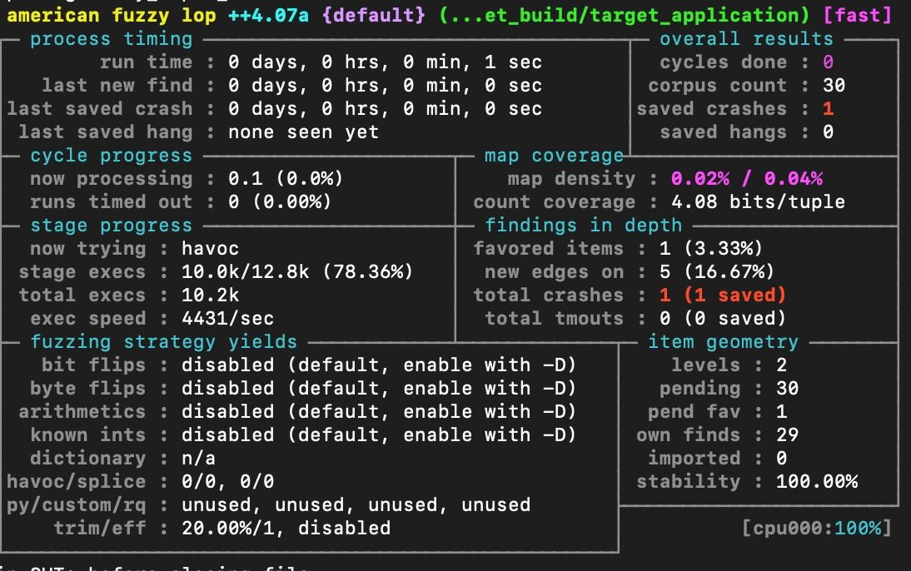

# Practical Fuzzing
This repository is a resource for learning how to practically use IDA, gdb, Frida, and AFL++ to fuzz a simple application that may have a license check and/or user interaction.

## Repo Structure
- c code for a dummy target application (**target_src**)
- script to compile the dummy target application  with various security measures enabled or disabled (**custom_compile.sh**)
- build directory for target application (**target_build**)
- code demonstrating final solutions after following instructions (**solutions/**)
<!-- - miscellaneous notes (I, Andrew Fryer) made while doing security research that may be useful -->


# Instructions
## Create Ubuntu Docker Container (if you aren't running on Ubuntu already)
```bash
docker run -it -v .:/practical_fuzzing ubuntu:latest /bin/sh
    cd /practical_fuzzing
    # install gcc and lots of other things...
```

## Compile the target application without security features (no security features; with debug symbols)
```bash
./compile.sh
```
You'll see a couple warnings about pointer abuse... those are there on purpose.
You can see details about the file that was produced using the `file` command.
```sh
file ./target_build/target_application
```
This shows that the file is not stripped (so the debugging symbol information is in the file).

## Run the target application
```sh
./target_build/target_application # the program will exit immediately because it is simulating a failed license check
./target_build/target_application --help
```
Make note of the usage data that is printed out.
There is a cli argument you can pass to cause the program to run as if you had a license.
Ideally, we'd like to do our work without using that flag, but the flag is accessible in case it is helpful for your learning.

## Statically analyze the target application with IDA
Open IDA pro (64-bit version).
Then, open the target application (`./target_build/target_application`) from within IDA.
IDA should finish analyzing it quickly because it is small.

It is often easy to find text in a binary file.
Open the String sub-view (View->Open subviews->Strings).
Now, search (alt-T) for the string printed out in the usage data.
IDA should highlight the matching row.
Double-click on the address of the string (in the Address column of the Strigns view and in the matching row).
This will bring you to the location of the string in the IDA view.
Try pressing space to toggle between the text and graph representations of the IDA view.
Click on the address in the text IDA view to place the cursor on it and then press CTL-X to find all references in the code to that address.
The result should be a table with only one row.
Double-click it to navigate to the reference.
Scroll around; you should be able to work out what is going on in that function (the main function), espeacially if the binary file is not stripped.
Try opening the Pseudocode view (View->Open subviews->Generate pseudocode).
Right-click in the Pseudocode view and select Synchronize with->IDA View-A.
Now, moving around in one view will also move the other view.
You should be able to locate the function that performs the license check.
Take note of its name and (relative) address.
If you exaimine each of the places it is called, you're likely able to see how it is used and what its return value indicates.

## Debug the target application using GDB
```sh
gdb ./target_build/target_application
    b main
    r
```
Now, you should hit the breakpoint at the beginning of the main function.
If you continue execution normally (`c`), the program will exit because it fails the license check.
Display the disassembly of the license check function (`disassemble <name of license check function>`) and make note of the address of the `ret` instruction.
Set a breakpoint on the `ret` instruction (`b *<address>`).
<!-- https://reverseengineering.stackexchange.com/questions/21926/how-to-set-breakpoint-with-gdb-on-arbitrary-memory-location -->
Now, continue execution until that breakpoint (`c`) or step through the program until that breakpoint if you want to follow the execution of the program (`n` repeatedly).
Now, modify the return value of the function just before it returns.
(You can see the state of the registers with `info registers` and the return value is stored in the `rax` register.)
(You'll need to use the `set` gdb command. E.g. `set $ebx = 0x00`.)
<!-- `set $rax = 0x01` -->
Then, continue execution.
If all went well, you should see output from the target application.
As you are debugging, you will keeping hitting the breakpoint in the license check function and will have to modify its return value each time.
Hitting the up arrow key to access past commands or searching with CTL-R makes this more bearable, but it is still tedious to explore the behaviour of the program.
The second time you continue after hitting the breakpoint in the license check function, you won't see a gdb prompt.
This is because the program is waiting for input data on its stdin.
By default the target process will inherit its stdin from the gdb process, so you can just type in the same terminal and hit ENTER to send the text to the target process.
<!-- The application will then be waiting for input data on its stdin.
To feed it input, you can do the following:
```sh
mkfifo my_named_pipe
echo "input you want to send" > my_named_pipe & # or, `cat > my_named_pipe` in another terminal
gdb ./target_build/target_application
    r < my_named_pipe
```
It may be easiest to have 2 terminals open for this so that you can type into the named pipe as you please. -->
<!-- See if you can get the program to call the `parse_file` code. -->
<!-- You will need to modify the return value of license check function each time it runs.
Hitting the up arrow in the GDB REPL makes this process a bit more bearable, but it is still very frustrating to explore the behaviour of the program. -->

See if you can get the program to run the `parse_file` function on a file you've created on disk.
If you look at that function in IDA, you can probably work out what conditions will make the target application crash.

## Dynamic patching with Frida
Frida is a dynamic instrumentation toolkit that is very powerful.
First, make sure you have Python 3 installed.
Then, install Frida using pip.
```sh
pip3 install frida
pip3 install frida-tools
```
**Note: Before using Frida on linux, you'll need to run `sudo sysctl kernel.yama.ptrace_scope=0` "to enable ptracing non-child processes" (at mentioned [here](https://frida.re/docs/installation/)).**
Otherwise, you may get an error saying "process not found", which is rubbish.

### Optional:
<details><summary>Frida Warm-up</summary>
Frida can be invoked from the command line or through Python.
```sh
python3
    import frida
    # now you have access to the Frida Python API
```
In the Python REPL, try typing `frida.` and then hit TAB twice.
Autocompletion should show all the fields that are available.
Using autocomplete in the Python REPL is a very fast way to experiment with Frida.
<!-- Documentation is available at _. -->

Take a look inside `./frida_hook.py`.
```sh
less ./frida_hook.py
```
It imports the Frida package and then starts a Frida session.
`frida.attach` injects the Frida shared library into the specified running process and runs a thread in the process that can run JavaScript code and talks to the Frida client.
The other lines in `frida_hook.py` read a JavaScript file in to a Python string, sends the string over to the Frida thread in the target process and then waits for messages from the Frida thread, printing them out when they are recieved.
You can run the script like so:
```sh
python3 frida_hook.py
```
You'll get an error that if can't find the process unless you're already running `target_application` in another terminal.
To try this out, you'll have to run `./target_build/target_application -l` so that the the target application doesn't immediately fail the license check and exit.

The functionality in `./frida_hook.py` is very similar to the functionality baked in to the `frida` cli tool, which we will be using from here on because it provides a really nice development experience through a JavaScript REPL.
</details>

<!-- ### Optional: Record code coverage with Frida and load it in to IDA -->

### Frida patching
#### Run the `frida` cli tool
The `frida` cli tool connects to a running process by default.
You can run it like so:
```sh
# frida <process name or PID>; # e.g.:
frida target_application
```
(You may need to open a new terminal for frida to be on your path.)
You'll need to be running a process named "target application" already.
To do this, you'll need to run `target_application` with the `-l` flag.
If you are running multiple instances of `target_application`, use the PID to specify which one you want to attach to.
(You can use `pidof target_application` or `ps` to find the PIDs.)

You'll notice that you're dropped into a JavaScript REPL with some special commands which you can list with `%help`.
Now, you can type arbitrary JavaScript code and when you hit ENTER, it is executed inside the target process!
Type `quit` and ENTER to end the Frida session.

#### Circumvent the license check
Let's pretend that we don't have a license to test with (so we aren't allowed to run `./target_application` with the `-l` flag).
Run the `frida` cli tool on the target application with the `-f` and `--pause` flags to tell Frida to start up the target application rather than attaching to an existing process and to pause before letting the process execute its code.
Type `Process.` in to the JavaScript REPL.
You should see autocompletion options to access the properties of the variable `Process` that Frida has globally defined for us.
The documentation for the entire JavaScript API is available [here](https://frida.re/docs/javascript-api/).

Remember how painful it was to set `rax` using gdb every time the license check function ran?
We're going to do that automatically now.
Type out JavaScript code direclty in to the REPL and once it works you can copy it into a JavaScript file for future use.
`Process.enumerateModules()` returns the loaded modules.
The first module should be for the code in `./target_application`.
Calling `.enumerateSymbols()` on that module (represented as a JavaScript object) gives you a list of objects each with a `name` and an `address` property (assuming the binary has debug symbols).
Find the address of the license check function.
Now, use `Interceptor.attach` to modify the return value of the license check function each time it runs.
You'll need to use the global function `ptr`, a callback named `onLeave`, and `retval.replace`.
You'll know that you've got it right if the target application prints anything out (rather than exiting immediately) after you run `%resume` from the js REPL.

If you really can't figure it out (after actually trying!!), the solution is in `./solutions/license_check_retval.js`.
Once you've worked out what JavaScript code needs to run, you can automatically run the JavaScript code from a file by passing `-l <js file>` to `frida` on the command line.

#### Exploring the target application
It so happens that this target application (without using the `-l` flag to satisfy the license check) is difficult to work with.
If you run it directly (without having gdb or Frida start the process), it will exit before you can attach to it to stub out the license check.
Additionally, it is an interactive program that reads from stdin.
By default, Frida spawns the target process, letting it inherent file descriptors, so it has the same stdin, stdout, and stderr files as the Frida process.
In order to give input directly to the target process, pass the `frida` cli tool the `--stdio=pipe` option so that it pipes stdin, stdout, and stderr.
Then, type `Process.id` ENTER in to the js REPL to get the target application's process id.
Running `cat > /proc/<target process id>/fd/0` in another terminal will allow you to interactively write to the target process' stdin.
You don't need to use the `--pause` option anymore, assuming you pass `-l <your js script that stubs the license check function>`.

Now, you can explore the target application's behivour more easily than with gdb.
If Frida becomes unresposive, it may be useful to hit CTL-Z to suspend the Frida process, run `jobs -l` to get the Frida PID, and then run `kill -9 <the Frida PID>`.

### Working with a stripped binary (no debug symbols)
Run the following for a stripped file with all security features activated:
```sh
./compile_full_security.sh
```

This produces a binary file with no debug symbols and with several security features turned on.
This means that you'll need to modify your Frida js script to use addresses rather than symbol names.
It also makes it much more difficult to understand the code's disassembly in IDA.
Not only are the names of functions and variables missing, but there is extra code added in around the regular code that performs checks (implementing the security features).

Repeat the static analysis using IDA on `target_application_full_security` to find the relative address of the license check function.
Unless you have rebased the proggram in IDA to use a different base address, the addresses shown in IDA will use 0x00 as the base address, so they will be relative addresses.
The following sequence is one way to find the license check function:
- open the Strings view
- search for "Usage"
- follow the reference to the address of the string
- go backwards through the code to the decision to print the usage string
- follow normal control flow through the code (maybe hitting a few dead ends)
- see a call to `exit`
- examine the latest branch that led to the call to `exit`
- see which function's return value is used in the branch condition
- examine the function (does it do weird, license check things?)
- note the relative address of (the start of) the function

Once you have the relative address of the license check function, modify your Frida js script to use the base address of the target application (main) module plus the relative address instead of finding the address by searching through the symbols.
Accessing `some_module_object.base` in Frida gives a string that you'll need to use `parseInt` to turn in to a number before adding the relative address to it.

### ASLR
If you print out (console.log) the base address of the main (target application) module from the js REPL or script, you'll notice that it is different each time it runs.
This is due to a security feature called address randomization (ASLR), which causes modules to be loaded at different memory locations each time the application runs.
You can (temporarily) disable address randomization by running:
```sh
echo 0 | sudo tee /proc/sys/kernel/randomize_va_space
```
Now, the base address should be the same each time the target application runs.

You can enable address randomization by running:
```sh
echo 2 | sudo tee /proc/sys/kernel/randomize_va_space
```


## Fuzzing with AflPlusPlus and Frida
Fuzzing is a technique used to find vulnerabilities in which inputs to a system are repeatedly generated and executed.
AFLplusplus, a popular fuzzer, generates inputs by mutating existing inputs.
In our case, we start with an empty file, `corpus/seed`.
AFLplusplus has a Frida mode which uses Frida to capture binary code coverage of a process to guide the mutations and fuzzing process to find crashes more efficiently.
In this training resource, we will pretend we have no idea how the internals of the parsing function in the target application work and will try find an input to the parsing code that causes it to crash.
We will set up AFLplusplus to fuzz-test the target application binary without using the source code (binary-only fuzzing).

### Install AFLplusplus
```sh
git clone https://github.com/AFLplusplus/AFLplusplus.git
pushd AFLpluplus
make
pushd frida_mode
make
popd
popd
```
### Set up for fuzzing
```sh
mkdir corpus
echo "" >> corpus/seed
mkdir fuzzing_results
touch dummy_input_file.txt # This file will be opened by the target_application, but not actually read
```
Now, you can run the AFL++ fuzzer in Frida mode (`-O`) like so:
```sh
AFLplusplus/afl-fuzz -O -i corpus -o fuzzing_results -- ./target_build/target_application
```
It will automatically look for a file in your current working directory named `afl.js`.
Stubbing out the user and operating system interactions gets a bit complex.
(You need to keep track of the state of the target application and be careful not to stub out behaviour that AFL++ relies on.)
A template `afl.js` file is already in place in the same directory as this README file.
The file `afl.js` keeps track of the state of the application simulating user interactions (1= Input File path, 2= Exit application). 
If the code within `afl.js` is not intuitive to you, remember what specific user interaction we intend to simulate, as well as the functions that were called nearby in IDA. 
<!-- Then, take a look at the states that are defined within `afl.js`, when they are checked, how they change and what function/module is being intercepted when they do. -->
Then, look at the states that `app_state` can take on in `afl.js`.
Consider how `app_state` changes the behaviour of the code that simulates user interactions by intercepting function calls.
Once you understand the basic behavior of `afl.js`, add the code that circumvents the license check (From "Circumvent the license check") into the template `afl.js` where the file has the "TODO".
You'll know that fuzzing is working when the AFLplusplus dashboard has a "corpus count" greater than 1, as this means that AFLplusplus believes it is making progress.


You can enable seeing output from the target application process with an environment variable:
```sh
export AFL_DEBUG_CHILD=1
```
Now, you can hide the debug output like so:
```sh
export AFL_DEBUG_CHILD=
```
Note that when `AFL_DEBUG_CHILD` is set, you may only see the AFLplusplus dashboard when you stop fuzzing by pressing CTL-C.

After running it for a few minutes (perhaps 20,000 execs), you should see 'saved crashes' start to increase.
Hit CTL-C to stop fuzzing.

This will show the crashing inputs:
```sh
for f in ./fuzzing_results/default/crashes/id*; do echo '---'; xxd $f; echo ''; done | less
```

This will give some understanding of how it found the crashing inputs:
```sh
for f in ./fuzzing_results/default/queue/id*; do echo '---'; xxd $f; echo ''; done | less
```

You should be getting ~450 execs/sec.

Now, modify it so that it works using persistent mode (which makes the fuzzing process much faster).
In persistent mode, several inputs are executed in the same target application process instead of calling the `fork` system call each time an input is executed.
Persistent mode can be enabled using `Afl.setPersistentAddress`, which is documented in the [frida_mode](https://github.com/AFLplusplus/AFLplusplus/blob/stable/frida_mode/) directory, more specifically [here](https://github.com/AFLplusplus/AFLplusplus/blob/f596a297c4de6a5e1a6fb9fbb3b4e18124a24f58/docs/env_variables.md?plain=1#L647) with an example [here](https://github.com/AFLplusplus/AFLplusplus/blob/f596a297c4de6a5e1a6fb9fbb3b4e18124a24f58/frida_mode/Scripting.md).
The gist is that you specify the address of the start of a function and the function's `ret` instruction is automatically patched to jump back to the start of the function, which let's AFLplusplus execute another input without forking off another process.
<!-- You'll also need to modify the state transitions in `afl.js` so that we go back to entering '1' instead of entering '2'. -->
You'll also need to modify the state transitions in `afl.js` so that when the target application reaches the end of the parsing function, `afl.js` anticipates that the next thing the target application will do is open the file to be parsed instead of waiting for the user to enter '2'.
(Note that in the existing `afl.js` script by the intercepting the `read` function call).

If you really can't figure it out, the solution is in `./solutions/afl_persistent.js`.
You can change the path to the js script AFLplusplus runs by setting an environment variable:
```sh
export AFL_FRIDA_JS_SCRIPT=./solutions/afl_persistent.js
```

Now, you should be getting ~1500 execs/sec.

There are several ways to further improve the performance of fuzzing.
The important things for performance are only the operations that happen on every execution, which is only the operations in the `parse_file` function.
You could improve performance by replacing file open and close, disabling logging, and writing hooks in c using Frida's `CModule` instead of in js (to avoid context switches to the js vm).
`afl_persistent_optimized.js` in the solutions directory implements implements these optimizations and achieves over 10,000 execs/sec when `AFL_DEBUG_CHILD` and `AFL_DEBUG` are unset.
